[&larr; Index](../README.md)

## How to create a server on Digital Ocean

If you don't have an account on Digital Ocean you can get 10$ credit. Just sign up with the link:

**[Sign up and get 10$ credit](https://m.do.co/c/b8a4737a342d)**

#### 1. Visit [Droplets](https://cloud.digitalocean.com/droplets?refcode=b8a4737a342d) page

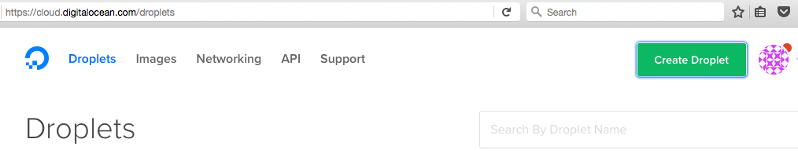

and

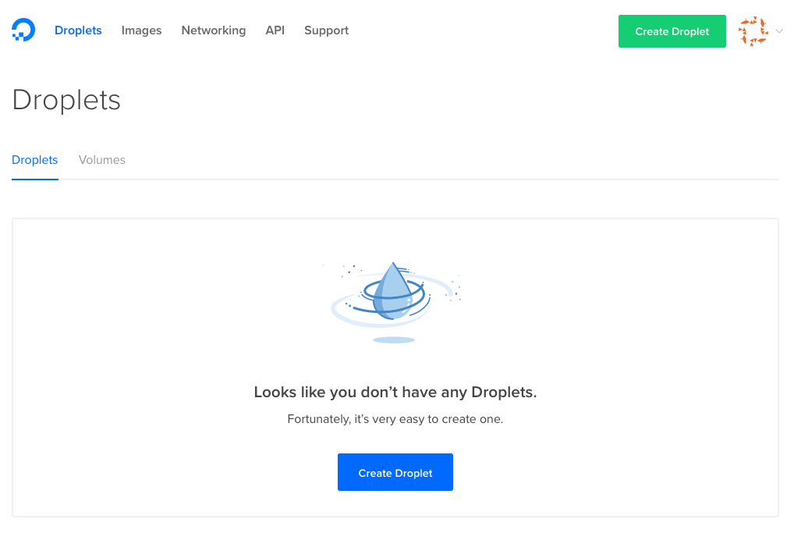

#### 2. Press the button "Create Droplet"

#### 3. Choose image, size and datacenter region

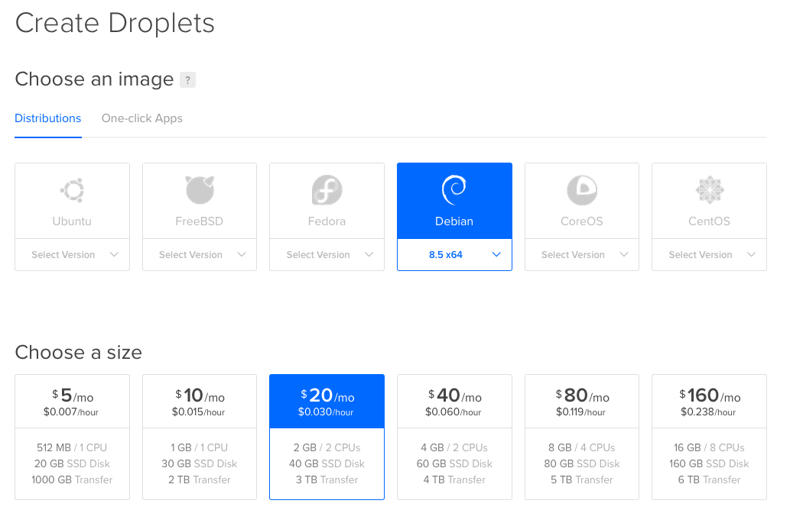

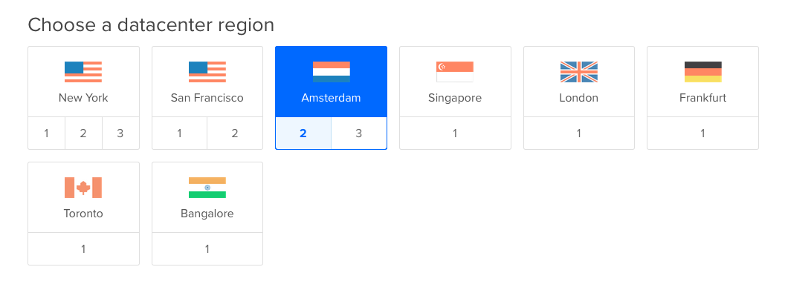

#### 4. Add your SSH key

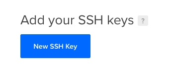

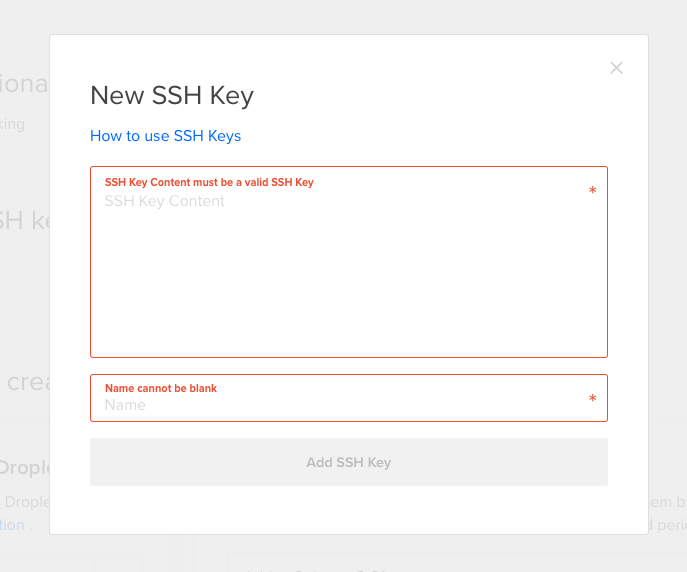

To check existed files you can use command

```
ls -al ~/.ssh/
```

If you don't have any keys then follow this link https://help.github.com/articles/generating-an-ssh-key/

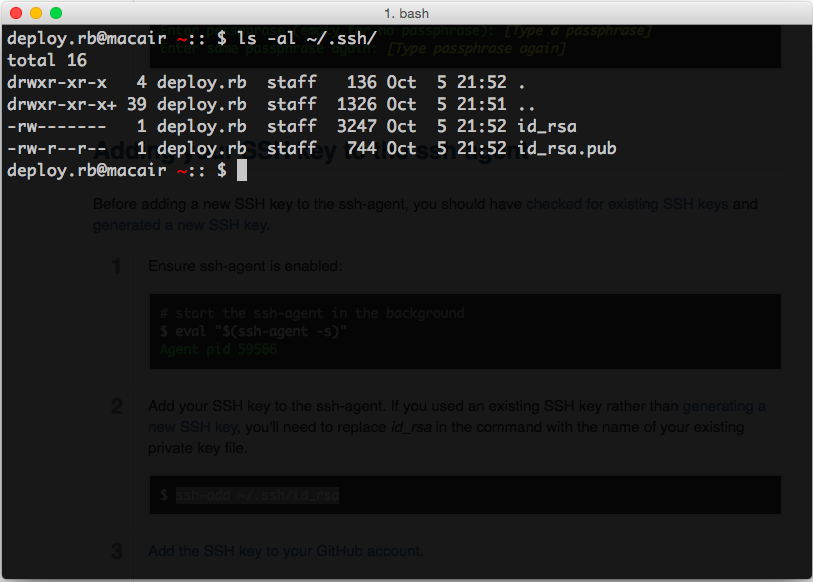

To get public part of the key usually you can do this:

```sh
cat ~/.ssh/id_rsa.pub
```

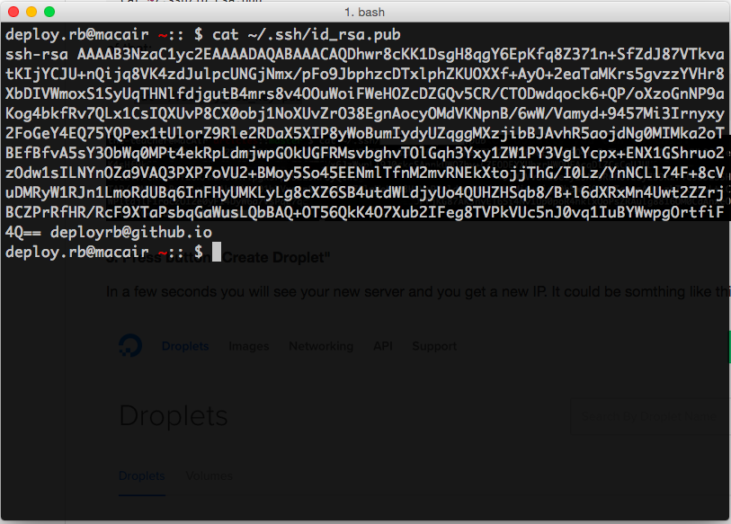

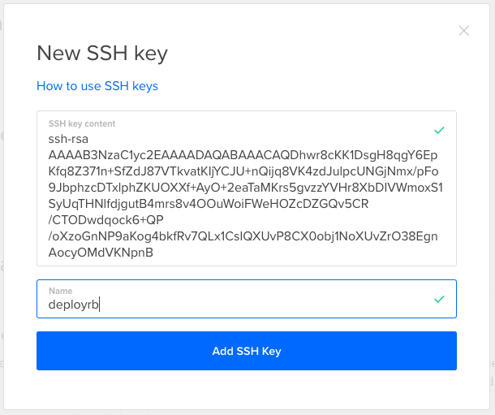

#### 5. Press button "Create Droplet"

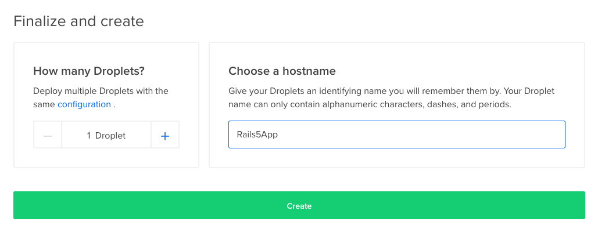

In a few seconds you will see your new server and you get a new IP.

It could be somthing like this `257.123.45.67`

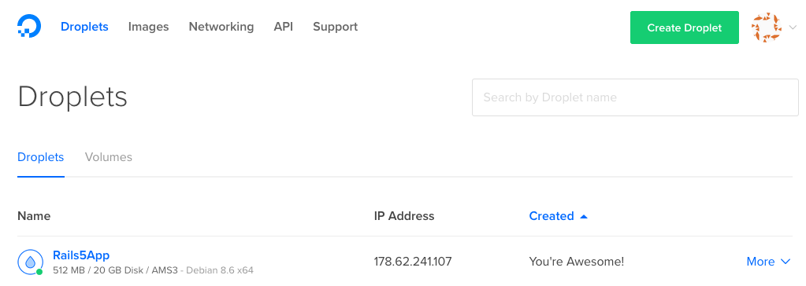

#### 6. Visit your server

To visit your server can use the following command

```sh
ssh root@257.123.45.67 -i ~/.ssh/id_rsa
```

or just

```sh
ssh root@257.123.45.67
```

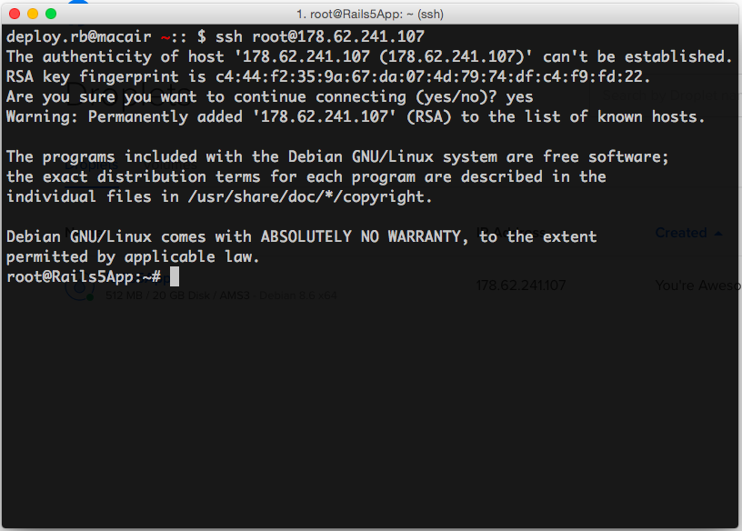

#### Go further

See also [How to setup a server on DO](../article-2/README.md)
