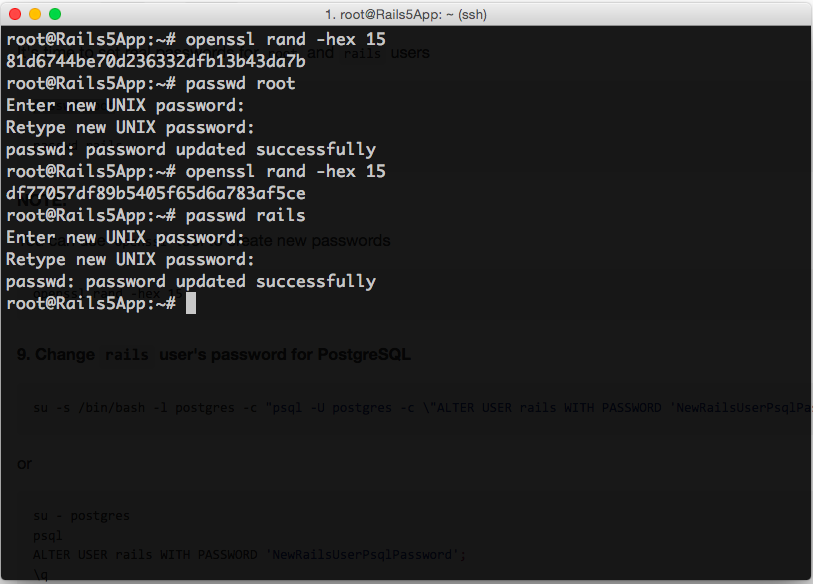
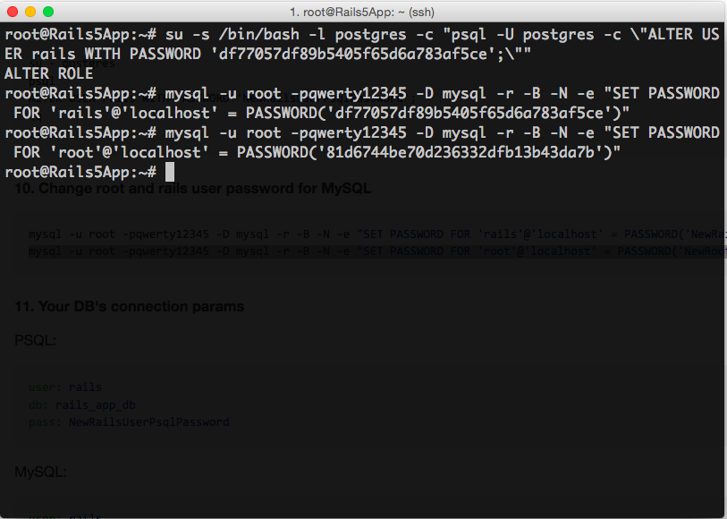

[&larr; Index](../README.md)

## How to setup a server on DO

#### 1. Create Droplet

See the article [How to install a server on DO](../article-1/README.md)

#### 2. If your SSH key has custom name but not `id_rsa`

<details>
  <summary>Optional step. Configurate your SSH</summary>

**Do it only if the name of your SSH key is not `id_rsa`**

```sh
[edit tool] ~/.ssh/config
```

Add the followig lines (do not forget to do required changes)

```sh
Host my_rails_server 257.123.45.67
  HostName 257.123.45.67
  IdentityFile ~/.ssh/my_rsa_key
  ForwardAgent yes
```

_This is an optional step._

Authorize your public key on your new Server.

```sh
cat ~/.ssh/my_rsa_key.pub | ssh root@257.123.45.67 'cat >> ~/.ssh/authorized_keys'
```

</details>

#### 3. Install TMUX

Visit your server `ssh root@257.123.45.67`


Install TMUX

```sh
apt-get install tmux -y
```


#### 4. Download and run Installation script

Open a new TMUX session

```sh
tmux new -s rails_server_install
```


Download and run the install script

```sh
wget https://raw.githubusercontent.com/DeployRB/SetupServer/master/article-2/install_script.sh
time ( source ./install_script.sh )
```


#### 5. Close your terminal window and wait

Even If you close your terminal window, Installation script and TMUX session will be alive. We will back later when Installation will be finished

#### 6. Check installation process

In 5-20 minutes (depends on powerful of your droplet) Installation process will be finished.

Visit your server and check TMUX console.

```sh
tmux ls
tmux a -t rails_server_install

exit
```


Screen of the successful installation


#### 7. Check Installed software

```sh
wget https://raw.githubusercontent.com/DeployRB/SetupServer/master/article-2/check_soft_script.sh
time ( source ./check_soft_script.sh )
```


<details>
  <summary>You will see something like that:</summary>


```sh
Linux 3.16.0-4-amd64 1 SMP Debian 3.16.7-ckt25-2+deb8u3 (2016-07-02) x86_64 GNU/Linux
PRETTY_NAME="Debian GNU/Linux 8 (jessie)" NAME="Debian GNU/Linux" VERSION_ID="8" VERSION="8 (jessie)"

Check LANG vars:

LANGUAGE has value: en_US:en
LANG has value: en_US.UTF-8
LC_ALL has value: en_US.UTF-8
LC_CTYPE has value: en_US.UTF-8

Programming Langs:

 rvm : Not found
 /usr/bin/ruby
 /usr/bin/node
 /usr/bin/python

Converters:

 /usr/bin/convert

CacheStores:

 /usr/local/bin/redis-server

DataBases:

 /usr/bin/psql
 /usr/bin/mysql

Search:

 /usr/bin/searchd

Helpers:

 /usr/bin/git
 /usr/bin/tmux
 /usr/local/bin/pygmentize

Image Optimizers:

 /usr/bin/gifsicle
 /usr/bin/jhead
 /usr/bin/jpegoptim
 /usr/bin/jpegtran
 /usr/bin/optipng
 /usr/bin/pngcrush
 /usr/bin/pngout
 /usr/bin/pngquant

WebServer:

 /usr/sbin/nginx
```

</details>


#### 8. Change `root` and `rails` users passwords

It's time to set real passwords for `root` and `rails` users

```sh
passwd root

passwd rails
```

**NOTE:**

You can use `openssl` tool to create new passwords

```sh
openssl rand -hex 15
```



#### 9. Change passwords for PostgreSQL and MySQL

```sh
su -s /bin/bash -l postgres -c "psql -U postgres -c \"ALTER USER rails WITH PASSWORD 'NewRailsUserPsqlPassword';\""
```

<details>
  <summary>Alternative way</summary>

```sh
su - postgres
psql
ALTER USER rails WITH PASSWORD 'NewRailsUserPsqlPassword';
\q
exit
```

</details>


```sh
mysql -u root -pqwerty12345 -D mysql -r -B -N -e "SET PASSWORD FOR 'rails'@'localhost' = PASSWORD('NewRailsUserMysqlPassword')"
mysql -u root -pqwerty12345 -D mysql -r -B -N -e "SET PASSWORD FOR 'root'@'localhost' = PASSWORD('NewRootUserMysqlPassword')"
```



#### 10. Your DB's connection params

PSQL:

```yml
user: rails
db: rails_app_db
pass: NewRailsUserPsqlPassword
```

MySQL:

```yml
user: rails
db: rails_app_db
pass: NewRailsUserMysqlPassword
```
